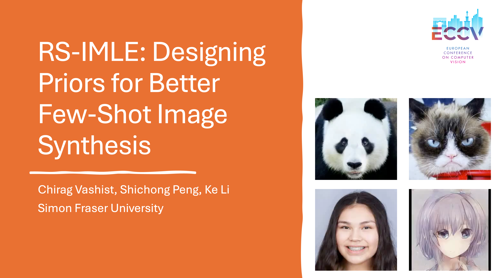

# Rejection Sampling IMLE: Designing Priors for Better Few-Shot Image Synthesis


**Accepted at European Conference on Computer Vision (ECCV) 2024**


[Project Site](https://serchirag.github.io/rs-imle/)| [Paper](https://arxiv.org/pdf/2409.17439) | Primary contact: [Chirag Vashist](https://serchirag.github.io/)

## Abstract
An emerging area of research aims to learn deep generative models with limited training data. Prior generative models like GANs and diffusion models require a lot of data to perform well, and their performance degrades when they are trained on only a small amount of data. A recent technique called Implicit Maximum Likelihood Estimation (IMLE) has been adapted to the few-shot setting, achieving state-of-the-art performance. However, current IMLE-based approaches encounter challenges due to inadequate correspondence between the latent codes selected for training and those drawn during inference. This results in suboptimal test-time performance. We theoretically show a way to address this issue and propose RS-IMLE, a novel approach that changes the prior distribution used for training. This leads to substantially higher quality image generation compared to existing GAN and IMLE-based methods, as validated by comprehensive experiments conducted on nine few-shot image datasets.

[](https://www.youtube.com/watch?v=TIXEiqfm-Bw)


## Requirements

```bash
virtualenv -p python venv
pip install -r requirements.txt
pip install -i https://test.pypi.org/simple/ dciknn-cuda==0.1.15
```

## Instructions


In order to train on FFHQ, you can run the following script:

```bash
./train.sh
```


## Citation


    @inproceedings{vashist2024rejectionsamplingimledesigning,
    	title = {Rejection Sampling IMLE: Designing Priors for Better Few-Shot Image Synthesis},
    	author = {Chirag Vashist and Shichong Peng and Ke Li},
    	booktitle = {Proceedings of the European Conference on Computer Vision (ECCV)},
    	year = {2024}
    }

